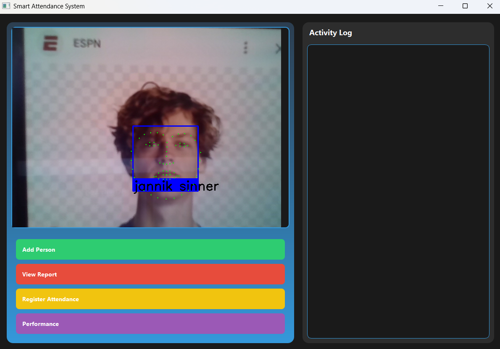
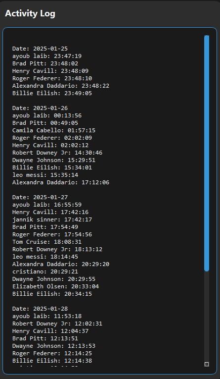
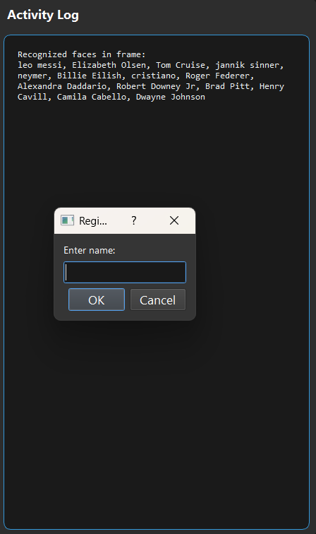

# Facial Recognition Attendance Management System

This project is a comprehensive and intelligent Python application that uses facial recognition to automate attendance management. It provides an intuitive graphical user interface (GUI) built with PyQt5 as well as a command-line interface (CLI) for flexible usage.

The system can register new people, recognize them in real-time via a webcam, and log their attendance with additional security through a PIN system.

## 📸 Screenshots


_The main application interface recognizing a face in real-time via webcam._


_The right panel displaying the complete history of recorded attendance._


_The interface showing recognized faces in the image and requesting name for secure manual registration._

## ✨ Key Features

- **Real-Time Facial Recognition:** Uses the `dlib` library for robust face detection and encoding.
- **Automated Attendance System:** Automatically records the time of first detection of a known person in an `attendance.json` file.
- **New User Registration:** An interface allows adding new people to the system by capturing multiple images from the webcam.
- **PIN Security:** Each user is assigned a unique PIN during registration, allowing manual attendance verification.
- **Multiprocessing Optimization:** The known face encoding phase is accelerated using `ProcessPoolExecutor` to leverage multi-core processors.
- **Advanced Performance Evaluation:** The system can generate a comprehensive performance report, testing different tolerance and jitter configurations to evaluate model precision, recall, and F1 score.
- **Dual Interface:**
  - **GUI (PyQt5):** A complete and user-friendly desktop application (`interfaceAPP.py`).
  - **CLI (argparse):** A command-line interface for scripted usage (`faciale.py`).

## 🛠️ Technologies and Libraries

- **Python 3**
- **OpenCV** for video capture and processing
- **Dlib** for facial recognition algorithms
- **PyQt5** for the graphical interface
- **Scikit-learn, Matplotlib, Seaborn, Pandas** for performance evaluation and visualization
- **Multiprocessing** for performance optimization

## 🚀 How to Run

### Prerequisites

1. **Install Python dependencies:**
   ```bash
   pip install -r requirements.txt
   ```

2. **Dlib Pre-trained Models:**
   This project requires `dlib` model files:
   - `dlib_face_recognition_resnet_model_v1.dat`
   - `shape_predictor_68_face_landmarks.dat`
   - `shape_predictor_5_face_landmarks.dat`

### Running the Application

- **To launch the graphical interface (GUI):**
  ```bash
  python interfaceAPP.py
  ```

- **To use the command-line interface (CLI):**
  ```bash
  python faciale.py --input Dataset
  ```

## 📂 Project Structure

```
facial-recognition-attendance/
├── interfaceAPP.py          # GUI application entry point (PyQt5)
├── faciale.py               # Core facial recognition logic and CLI interface
├── requirements.txt         # Python dependencies
├── Dataset/                 # Directory containing known persons' images
│   ├── Person1/
│   ├── Person2/
│   └── ...
├── pretrained_model/        # Dlib pre-trained models
│   ├── dlib_face_recognition_resnet_model_v1.dat
│   ├── shape_predictor_68_face_landmarks.dat
│   └── shape_predictor_5_face_landmarks.dat
├── screenshots/             # Application screenshots
├── attendance.json          # Attendance records file
├── pin_database.json        # PIN database for each person
└── README.md               # This file
```

## 🔧 Installation Guide

### 1. Clone the Repository
```bash
git clone https://github.com/yourusername/facial-recognition-attendance.git
cd facial-recognition-attendance
```

### 2. Create Virtual Environment (Recommended)
```bash
python -m venv venv
source venv/bin/activate  # On Windows: venv\Scripts\activate
```

### 3. Install Dependencies
```bash
pip install -r requirements.txt
```

### 4. Download Dlib Models
Download the required model files and place them in the `pretrained_model/` directory:
- [dlib_face_recognition_resnet_model_v1.dat](http://dlib.net/files/dlib_face_recognition_resnet_model_v1.dat.bz2)
- [shape_predictor_68_face_landmarks.dat](http://dlib.net/files/shape_predictor_68_face_landmarks.dat.bz2)
- [shape_predictor_5_face_landmarks.dat](http://dlib.net/files/shape_predictor_5_face_landmarks.dat.bz2)

## 📝 Usage Instructions

### GUI Application
1. Run `python interfaceAPP.py`
2. Use the interface to:
   - Register new users by capturing multiple face images
   - Start real-time attendance monitoring
   - View attendance history and logs
   - Manage user database and PIN assignments

### CLI Application
```bash
# Basic usage
python faciale.py --input Dataset

# With custom parameters
python faciale.py --input Dataset --tolerance 0.5 --jitter 10

# Performance evaluation mode
python faciale.py --evaluate --input Dataset
```

## 🎯 Performance Features

The system includes advanced performance evaluation capabilities:
- **Precision, Recall, and F1 Score** metrics
- **Tolerance and Jitter** parameter optimization
- **Confusion Matrix** visualization
- **Performance Report** generation with detailed statistics

## 🔒 Security Features

- **PIN Verification:** Each user has a unique PIN for manual attendance confirmation
- **Face Encoding:** Secure face representation using dlib's neural network
- **Attendance Logging:** Timestamped records with user identification
- **Data Integrity:** JSON-based secure data storage

## 🚀 Future Enhancements

- [ ] Web-based interface
- [ ] Database integration (MySQL/PostgreSQL)
- [ ] Mobile app companion
- [ ] Advanced analytics dashboard
- [ ] Multi-camera support
- [ ] Cloud deployment options

## 🤝 Contributing

1. Fork the repository
2. Create a feature branch (`git checkout -b feature/AmazingFeature`)
3. Commit your changes (`git commit -m 'Add some AmazingFeature'`)
4. Push to the branch (`git push origin feature/AmazingFeature`)
5. Open a Pull Request

## 📄 License

This project is licensed under the MIT License - see the [LICENSE](LICENSE) file for details.

## 🙏 Acknowledgments

- **Dlib** for providing excellent facial recognition algorithms
- **OpenCV** for computer vision capabilities
- **PyQt5** for the user-friendly GUI framework
- **Scikit-learn** for machine learning evaluation tools

## 📞 Support

For support, email your-email@example.com or create an issue in the GitHub repository.

---

This project demonstrates advanced skills in computer vision, software development, and data analysis, making it an excellent showcase for your GitHub profile.
